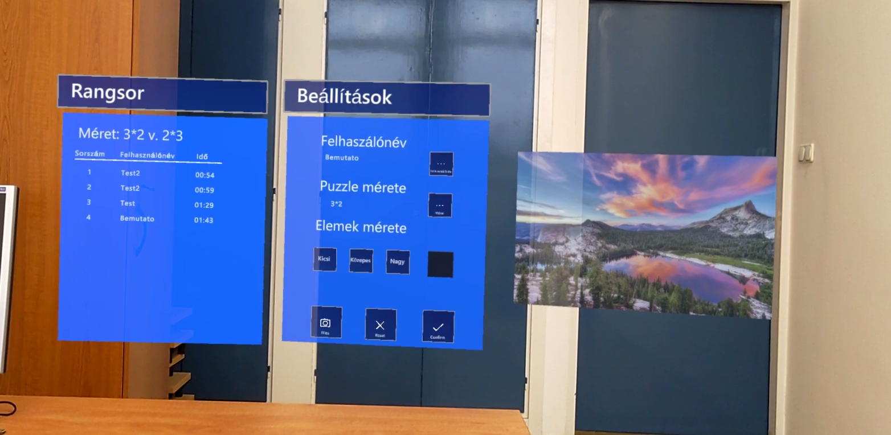
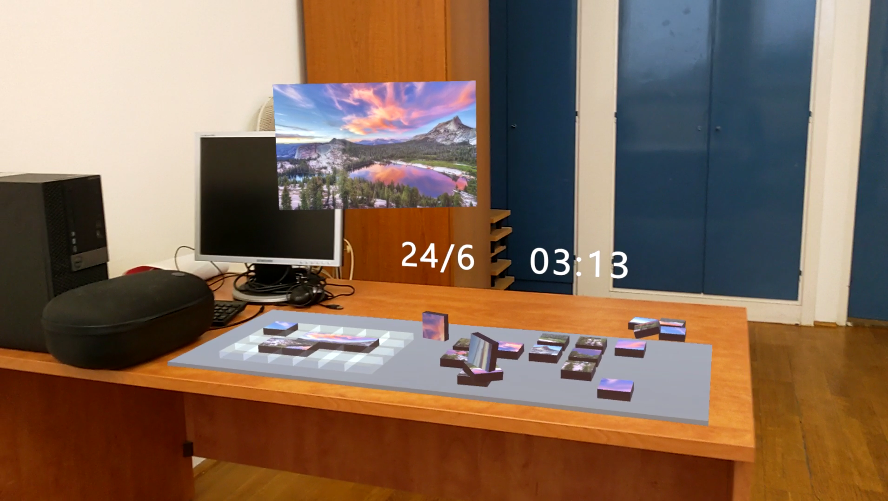
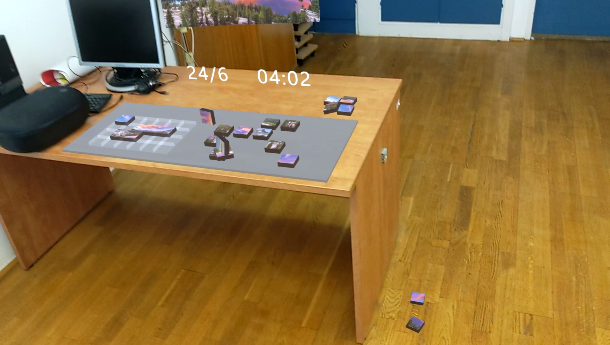
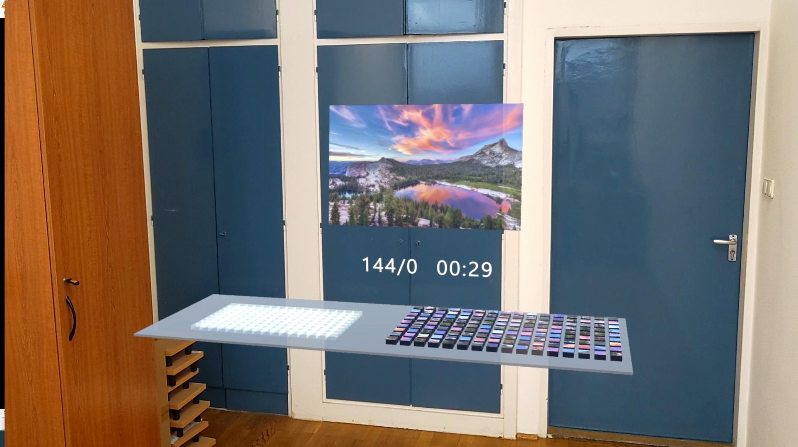

# AR-Puzzle
AR puzzle game for mixed reality headsets, primarily developed for Hololens 2.

## Features
- Users can choose the puzzel's picture and size
- Users can choose the size of the individual pieces
- Virtual objects interact with real world objects
- The game tracks the amount of time needed for each succesful completion of puzzels
- The game saves the time with the player's username to a leaderboard based on the finished puzzle's picture and size

## Screenshots
The game's main menu with leaderboard, options, and picture preview

Game state demonstrating virtual object interactions

Large game with small pieces

### GIFs
GIFs showing virtual object interactions

 <table>
  </tr>
  <tr>
    <td></td>
    <td></td>
    <td></td>
  </tr>
</table> 

